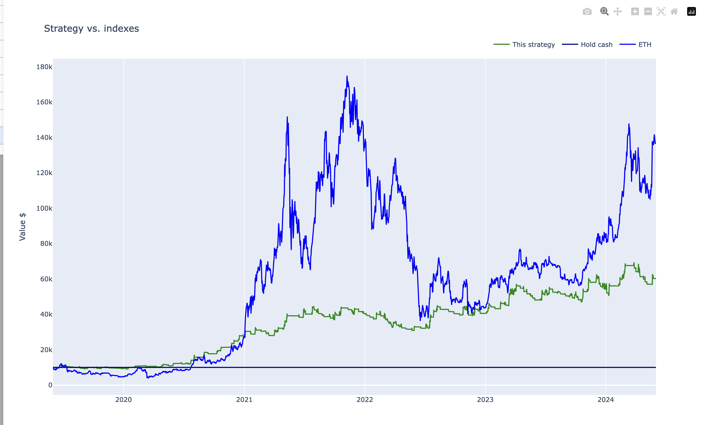

# DEX live trading strategy deployment example

This is an example repository for setting up a `docker-compose.yml` for a minimal live [trade-executor](https://github.com/tradingstrategy-ai/trade-executor/).

- This allows you to start a live trade execution in your computer using Docker
- It is a limited preproduction environment with devops and web frontend missing
- We use Polygon environment as it is an easy and cost-friendly way to do some test trades
- The folder structure is set up in a manner you can run several trade executors under the same `docker-compose.yml` configuration

* [Step 1: Develop a trading strategy](#step-1-develop-a-trading-strategy)
* [Step 2: Give the strategy id](#step-2-give-the-strategy-id)
* [Step 3: Extract strategy as a Python module](#step-3-extract-strategy-as-a-python-module)
* [Step 4: Set up docker-compose.yml entry](#step-4-set-up-docker-composeyml-entry)
* [Step 5: Set up an environment file](#step-5-set-up-an-environment-file)
* [Step 6: Launching Docker for the first time](#step-6-launching-docker-for-the-first-time)
   * [Step 6a: Set Github container registry access](#step-6a-set-github-container-registry-access)
   * [Step 6b: Test Docker container start](#step-6b-test-docker-container-start)
* [Step 7: Run backtest for the strategy module](#step-7-run-backtest-for-the-strategy-module)
* [Step 8: Set up a hot wallet](#step-8-set-up-a-hot-wallet)
   * [Step 8a: Generate a private key](#step-8a-generate-a-private-key)
   * [Step 8b: Add the private key environment variable file](#step-8b-add-the-private-key-environment-variable-file)
   * [Step 8c Check the wallet](#step-8c-check-the-wallet)
   * [Step 8d: Fund the account](#step-8d-fund-the-account)
   * [Step 8e: Check the wallet again](#step-8e-check-the-wallet-again)
* [Step 9: Check the trading universe](#step-9-check-the-trading-universe)
* [Step 10: Init the strategy](#step-10-init-the-strategy)
* [Step 11: Perform test trade](#step-11-perform-test-trade)
* [Step 12: Launch the live trading strategy](#step-12-launch-the-live-trading-strategy)
* [Step 13: Configure additional RPC providers (optional)](#step-13-configure-additional-rpc-providers-optional)
* [Step 14: Set up Discord logging (optional)](#step-14-set-up-discord-logging-optional)
* [Support and social media](#support-and-social-media)

# Preface

This is an example repository to do partial deployment for live trading strategies.

You need
- Basic experience in UNIX system administration 
- Linux / macOS laptop 
  - On Windows, use Windows Subsystem for Linux (WSL)
- Docker installation 

This preproduction set up can be more straightforward than the actual production deployment, as we shortcut a few things here:
- Security like managing the access to the private keys
- Web frontend
- Devops and diagnostics output: Only output is Docker process stdout

# Step 1: Develop a trading strategy

See [Getting started](https://github.com/tradingstrategy-ai/getting-started) if you do not have a trading strategy yet.

The usual deliverables of developing a trading strategy include: 

1. Initial backtest notebook
2. Optimiser that crunches through multiple parameters
2. Final backtest notebook with fixed parameters you are prepared to take to the live trading

This repository comes with a simple example ETH-USDC strategy. 

For this example we have 

1. Initial backtest - somewhere in [Getting started repo](https://github.com/tradingstrategy-ai/getting-started)
2. Optimiser notebook. [See here](./notebooks/eth-breakout-optimiser.ipynb)
3. Final backtest. [See here](./notebooks/eth-breakout-dex-final.ipynb)

**Note**: This strategy might be too simple and overfit for real world trading.

# Step 2: Give the strategy id

You are going to have a lot of strategies. You need to have a systematic way to keep track of them.

We are going to us `hotwallet-polygon-eth-usdc-breakout`. It's a mouthful, but self-explanatory.

This id is used in

- URLs
- State file
- Log files 
- etc.

# Step 3: Extract strategy as a Python module

We convert the final backtest notebook to a Python module. We use (3) from the step above as the starting point.

Rules to convert

- Create a Python file
- Copy-paste the strategy from the notebook 
  - `Parameteters` class
  - `decide_trades`
  - `create_indicators`
  - `create_strategy_universe`
- Autocomplete the imports for the Python file
  - Usually a good editor like Visual Studio Code or PyCharm can do this for you with a keypress or two
- Modify `create_strategy_universe` to cater to both the backtesting and live trading
  - Different options are available if you want to show DEX backtesting data (usually too short period)
- Add the following Python module variables 

```python
trading_strategy_engine_version = "0.5"
name = "ETH-BTC-USDC momentum"  # Optional: Frontend metadata
tags = {StrategyTag.beta, StrategyTag.live}  # Optional: Frontend metadata
icon = ""  # Optional: Frontend metadata
short_description = ""  # Optional: Frontend metadata
long_description = ""  # Optional: Frontend metadata
```

We also edit the strategy to dynamically decide which trading universe to use
- Binance for backtesting (longer history)
- DEX for live trading

Example modification here:

```python
def get_strategy_trading_pairs(execution_mode: ExecutionMode) -> list[HumanReadableTradingPairDescription]:
    if execution_mode.is_backtesting():
        # Need longer history
        trading_pairs = [
            (ChainId.centralised_exchange, "binance", "ETH", "USDT"),
        ]

    else:
        # For live trading we do Uniswap v3 on Polygon
        trading_pairs = [
            (ChainId.polygon, "uniswap-v3", "WETH", "USDC", 0.0005),
        ]
    return trading_pairs


def create_trading_universe(
    timestamp: datetime.datetime,
    client: Client,
    execution_context: ExecutionContext,
    universe_options: UniverseOptions,
) -> TradingStrategyUniverse:
    """Create the trading universe."""
    trading_pairs = get_strategy_trading_pairs(execution_context.mode)

    if execution_context.mode.is_backtesting():
        # Backtesting - load Binance data to get longer history
        strategy_universe = create_binance_universe(
            [f"{p[2]}{p[3]}" for p in trading_pairs],
            candle_time_bucket=Parameters.candle_time_bucket,
            stop_loss_time_bucket=Parameters.stop_loss_time_bucket,
            start_at=universe_options.start_at,
            end_at=universe_options.end_at,
            forward_fill=True,
        )        

    else:
        # How many bars of live trading data needed
        required_history_period = Parameters.required_history_period

        dataset = load_partial_data(
            client=client,
            time_bucket=Parameters.candle_time_bucket,
            pairs=trading_pairs,
            execution_context=execution_context,
            universe_options=universe_options,
            liquidity=False,
            stop_loss_time_bucket=Parameters.stop_loss_time_bucket,
            required_history_period=required_history_period,
        )
        # Construct a trading universe from the loaded data,
        # and apply any data preprocessing needed before giving it
        # to the strategy and indicators
        strategy_universe = TradingStrategyUniverse.create_from_dataset(
            dataset,
            reserve_asset="USDC",
            forward_fill=True,
        )

    return strategy_universe
```

- [See the full resulting Python file here](./strategies/hotwallet-polygon-eth-usdc-breakout.py) 

# Step 4: Set up docker-compose.yml entry

- [See docker-compose.yml](./docker-compose.yml)

**Note**: We use new style `docker compose` commands in this README, instead of `docker-compose` legacy command (with dash). Make sure you have the latest version.

# Step 5: Set up an environment file

Each trade executor docker is configured using environment variable files using the normal Docker conventions.

**Note**: For the production deployment it is recommend against putting any highly sensitive material like private keys
directly to these files/

- See [hotwallet-polygon-eth-usdc-breakout.env](./hotwallet-polygon-eth-usdc-breakout.env)

The file comes with

- No hot wallet set up
- No Trading Strategy API key set up 
- Public low quality Polygon RPC endpoint (do not use for production - likely just keeps crashing)

# Step 6: Launching Docker for the first time

## Step 6a: Set Github container registry access

Docker images are distributed on [Github Container Registry ghcr.io](https://github.com/features/packages).
The access is public, but you need to have an access token through your Github account.

To enable docker login to Github see [how to set up Github access token to download Docker images from GHCR](https://docs.github.com/en/packages/working-with-a-github-packages-registry/working-with-the-container-registry>).

- [Create a personal access tokens in Developer settings of your Github account](https://github.com/settings/tokens>) - classic token
 
- You need an access token to publish, install, and delete private, internal, and public packages:
  `repo:*`.

When you find your token you can do:

```shell
GITHUB_USERNAME=miohtama
# Your Personal Access Token (classic)
CR_PAT=ghp_mmc...
# This will save a config file locally with your GHCR access key
echo $CR_PAT | docker login ghcr.io -u $GITHUB_USERNAME --password-stdin
```

Docker login should reply:

```
Login Succeeded
```

## Step 6b: Test Docker container start

We try to run and verify our Docker Compose launches.

First we need to choose the trade-executor release. The trade executor is under active development
and may see multiple releases per day. [You can find releases on Github](https://github.com/tradingstrategy-ai/trade-executor/pkgs/container/trade-executor)

```shell
# Get the latest trade-executor version tag from Github to environment variable
source scripts/export-latest-trade-executor-version.sh

# Launch to show the command line help
docker compose run hotwallet-polygon-eth-usdc-breakout --help
```

You should see the command line help for [trade-executor command](https://tradingstrategy.ai/docs/deployment/trade-executor.html):

```
Usage: trade-executor [OPTIONS] COMMAND [ARGS]...

Options:
  --install-completion [bash|zsh|fish|powershell|pwsh]
                                  Install completion for the specified shell.
  --show-completion [bash|zsh|fish|powershell|pwsh]
                                  Show completion for the specified shell, to copy it or customize the installation.
  --help                          Show this message and exit.
...
```

# Step 7: Run backtest for the strategy module

This will run the strategy backtest using `docker compose` command.

- This command will execute the same backtest as you would have run earlier in the final notebook
- Python errors when running this command will catch any mistakes made during the strategy module creation
- Backtest artifacts like HTML backtest report are written under `state/` folder
- The same artifacts will be served in the web frontend for the users who want to see the backtest results

You need to add your [Trading Strategy API key](https://tradingstrategy.ai/trading-view/api) in [./env/hotwallet-polygon-eth-usdc-breakout.env](./env/hotwallet-polygon-eth-usdc-breakout.env):

Now run the backtest:

```shell
docker compose run hotwallet-polygon-eth-usdc-breakout backtest
```

**Note**: Currently macOS and Apple Silicon run Intel architecture Docker images, slowing down the execution 5x - 10x. [Github Actions do not support building macOS Docker images yet](https://stackoverflow.com/a/78202969/315168). When you run this command on macOS prepare to wait for ~20 minutes.

You are likely to encounter several Python bugs in this step, so keep fixing your Python strategy module.

The end of the output should look like:

```
Writing backtest data the state file: /usr/src/trade-executor/state/hotwallet-polygon-eth-usdc-breakout-backtest.json
Exporting report, notebook: state/hotwallet-polygon-eth-usdc-breakout-backtest.ipynb, HTML: state/hotwallet-polygon-eth-usdc-breakout-backtest.html
```

After the backtest is complete, you can view the HTML report:

```shell
# macOS way to open a HTML file from the command line
open state/hotwallet-polygon-eth-usdc-breakout-backtest.html
```

You should see the backtest results, as captured from the default backtest notebook template:



# Step 8: Set up a hot wallet

You need a hot wallet

- It costs ETH/MATIC/etc. to broadcast the transactions for your trades
- A hot wallet is just an EVM account with the associated private key 

## Step 8a: Generate a private key

To create a hot wallet for the executor you can [do it from the command line](https://ethereum.stackexchange.com/questions/82926/how-to-generate-a-new-ethereum-address-and-private-key-from-a-command-line):

```shell
head -c 32 /dev/urandom|xxd -ps -c 32
```

This will give you a private key (example - do not use this private key):

```
68f4e1be83e2bd242d1a5a668574dd3b6b76a29f254b4ae662eba5381d1fc3a6
```

Then

- Store the private key safely in your backup storage (password manager, or something stronger depending on the security level)

**Note**: Hot wallets cannot be shared across different `trade-executor` instances, because this will mess up accounting.

## Step 8b: Add the private key environment variable file

Private key will be needed in the trade execution configuration file

- Edit `hotwallet-polygon-eth-usdc-breakout.env`.
- Add `0x` prefix to the raw hex output from the step above
- Fill in `PRIVATE_KEY`.

Example:

```shell
# Do not use this private key 
PRIVATE_KEY=0x68f4e1be83e2bd242d1a5a668574dd3b6b76a29f254b4ae662eba5381d1fc3a6
```

## Step 8c Check the wallet

`trade-executor` provides the subcommand `check-wallet` to check the hot wallet status.

This checks

- You are connected to the right blockchain

- Your hot wallet private key has been correctly set up

- You have native token for gas fees

- You have trading capital

- The last block number of the blockchain

- We know how to route trades for our strategy, using the current wallet


```shell
docker compose run hotwallet-polygon-eth-usdc-breakout check-wallet
```
    
Output:

```
AssertionError: At least 0.1 native currency need, our wallet 0xABF10A4027B3e5D29c21292955DcC4ECCe05747A has 0.00000000
```

This gives you the address for your private key.

## Step 8d: Fund the account

We need to fund the account on Polygon

- MATIC to cover the gas fees: get 25 MATIC.
- [USDC.e](https://tradingstrategy.ai/trading-view/polygon/tokens/0x2791bca1f2de4661ed88a30c99a7a9449aa84174), also known USD Coin PoS: get 25 USDC.e.

You can use a service like [Transak](https://transak.com/) to get MATIC with a debit card. KYC needed.
You can get MATIC swapped to USDC.e e.g. on [KyberSwap](https://kyberswap.com/swap/polygon).

Send MATIC and USDC.e to the address you saw above.

**Note**: Due to historical reasons we use USDC.e (bridged variant) over native USDC on Polygon,
because it has better liquidity. These two tokens are not fungible as the writing of this.

## Step 8e: Check the wallet again

Now you should have some MATIC and USDC.e in your hot wallet.


```shell
docker compose run hotwallet-polygon-eth-usdc-breakout check-wallet
```
    
We see the account is funded now:

```
Balance details
  Hot wallet is 0xABF10A4027B3e5D29c21292955DcC4ECCe05747A
  We have 10.000000 tokens left for gas
  The gas error limit is 0.100000 tokens
  Reserve asset: USDC 
Reading token balances for 1 tokens at block 59193849, last 
  Balance of USD Coin (PoS) (0x2791Bca1f2de4661ED88A30C99A7a9449Aa84174): 1.988353 USDC
```

# Step 9: Check the trading universe

`trade-executor` provides the subcommand `check-universe` to ensure the market data feeds work correctly.

- This confirms your Trading Strategy oracle API keys are correctly set up
  and your strategy can receive data.

- The market data feed is up-to-date

You can run this with configured `docker-compose` as:

```shell
docker compose run hotwallet-polygon-eth-usdc-breakout check-universe
```

This will print out the last available candle, based on the the strategy `Parameters.candle_time_bucket`:

```
Latest OHCLV candle is at: 2024-07-10 15:00:00, 0:19:41.794234 ago
```

# Step 10: Init the strategy

This will write the initial state file for your trading strategy:

```shell
docker compose run hotwallet-polygon-eth-usdc-breakout init
```

It should output something like:

```
Saved state to state/hotwallet-polygon-eth-usdc-breakout.json, total 1,108 chars
All done: State deployment info is <Deployment chain:polygon address:0xABF10A4027B3e5D29c21292955DcC4ECCe05747A name:None token:None>
```

# Step 11: Perform test trade

After you are sure that trading data and hot wallet are fine,
you can perform a test trade from the command line.

- This will ensure trade routing and execution gas fee methods
  are working by executing a live trade against live blockchain.

- The test trade will buy and sell the "default" asset of the strategy
  worth 1 USD. For a single pair strategies the asset is the default
  base token.

- This will open a position using the strategy's exchange and trade
  pair routing.

- The position and the trade will have notes field filled in that
  this was a test trade.

- Broadcasting a transaction through your JSON-RPC connection
  works.

Example:

```shell
docker compose run hotwallet-polygon-eth-usdc-breakout perform-test-trade
```

This will print something like:

```
Test trade report
  Gas spent: 0.016125835459386936
  Trades done currently: 2
  Reserves currently: 1.986876 USDC
  Reserve currency spent: 0.0014769999999999506 USDC
  Buy trade price, expected: 3113.8176546091504, actual: 3111.
  Sell trade price, expected: 3108.3790383082533, actual: 3110.0700549742683 (WETH-USDC)
```

# Step 12: Launch the live trading strategy

Now you are ready to start the strategy.

We first suggest start on the foreground.

```shell
docker compose up hotwallet-polygon-eth-usdc-breakout
```

After the boot up dance you will see:

```
apscheduler.scheduler                              INFO     Scheduler started
```

This means the trade-executor is now running, with its scheduled tasks (decide trades, check stop losses, revalue the portfolio, etc.). Leave it running.

There is a lot of output (noisy). In some point you should catch the message about `decide_trades`:

```
 2024-07-11 08:08:27 tradeexecutor.strategy.runner                      INFO     No open 
 2024-07-11 08:08:27 tradeexecutor.strategy.runner                      INFO     No frozen 
 2024-07-11 08:08:27 tradeexecutor.strategy.runner                      TRADE    Portfolio 
 
 Total equity: $1.99, in cash: $1.99
 Life-time positions: 1, trades: 2
 …
 Reserves:
 
     1.99 USDC
 
 2024-07-11 08:08:27 tradeexecutor.utils.timer                          INFO     Starting task decide_trades at 2024-07-11 08:08:27.183694, context is {}
```

The given strategy rebalances every 1h. So you should see something working or not working within 1h. The rebalance does not happen exactly at 00 minutes, but a bit past, as the candle data needs to be properly formed first.

For the long-term running, use daemon option:

```shell
docker compose up -d hotwallet-polygon-eth-usdc-breakout
```

# Step 13: Configure additional RPC providers (optional)

- The configuration line `JSON_RPC_POLYGON` accepts multiple space separared provided URLs.
- The same feature can be used to add MEV protected RPC endpoints for your trade executor

[See the multi-RPC configuration documentation here](https://web3-ethereum-defi.readthedocs.io/tutorials/multi-rpc-configuration.html).

# Step 14: Set up Discord logging (optional)

In this example, we only output trades in the docker console.

The trade-executor supports output to different team chat mediums. like Discord.

To configure Discord logging

- Create a private Discord channel
- In the channel settings, go to *Integrations*
- Press *Create Webhook*
- Add the webhook URL in the environment variable file as `DISCORD_WEBHOOK_URL`

```
DISCORD_WEBHOOK_URL=https://discord.com/api/webhooks/12...
```
Now all trade-related logging messages will be displayed at the Discord channel as well.

# Support and social media

Got any questions? Pop into our Discord.

- [Trading Strategy community Discord server](https://tradingstrategy.ai/community#discord)
- [Trading Strategy website](https://tradingstrategy.ai)
- [Blog](https://tradingstrategy.ai/blog)
- [Twitter](https://twitter.com/TradingProtocol)
- [Telegram channel](https://t.me/trading_protocol)
- [Newsletter](https://tradingstrategy.ai/newsletter)
